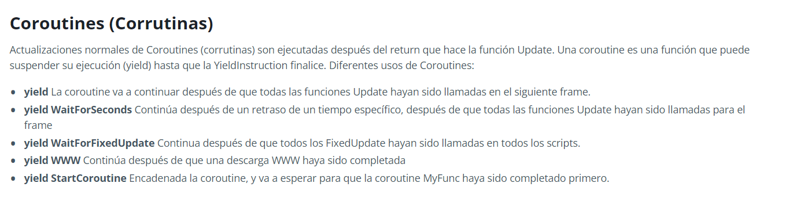

# Taller #2 Scripting
---
## Link de la presentación

https://www.canva.com/design/DAGB-3HUoQM/k_u-osnr_MLoFGj7MPcZTg/edit?utm_content=DAGB-3HUoQM&utm_campaign=designshare&utm_medium=link2&utm_source=sharebutton

### 2. Explicar por medio de un ejemplo de mínimo 5 funciones el concepto de delegado
---
Un delegado de C# es un objeto que representa un método. El delegado de C# le permite tratar un método como un valor, asignando el método a una variable, pasándolo a otros métodos como parámetros, agregándolo a una colección, etc.
~~~
namespace DelegadoScripting
{
    internal class Program
    {
        public delegate void Tecla(string s);

        public static void TeclaW(string s)
        {
            Console.WriteLine(s + " W");
        }

        public static void TeclaA(string s)
        {
            Console.WriteLine(s + " A");
        }

        public static void TeclaS(string s)
        {
            Console.WriteLine(s + " S");
        }

        public static void TeclaD(string s)
        {
            Console.WriteLine(s + " D");
        }

        public static void TeclaF(string s)
        {
            Console.WriteLine(s + " F");
        }

        static void Main(string[] args)
        {
            Tecla delegado;
            delegado = TeclaW;
            delegado += TeclaA;
            delegado += TeclaS;
            delegado += TeclaD;
            delegado += TeclaF;

            delegado.Invoke("Se oprimio la tecla:");

        }
    }
}

~~~
### 3. Consultar y crear un ejemplo donde se evidencie el uso de event en C# (Comparar el modelo de eventos definido en Corgi)
---
-   Un <b>evento</b> es una notificación enviada por un objeto para señalar la ocurrencia de una acción.
- La clase que genera eventos se llama <b>Publicador</b> y la clase que recibe la notificación se llama <b>Suscriptor.</b> Puede haber varios suscriptores de un solo evento. Normalmente, un editor genera un evento cuando se produce alguna acción. Los suscriptores que estén interesados ​​en recibir una notificación cuando se produzca una acción deben registrarse en un evento y gestionarlo.

Para implementar un evento en <b>C#</b> Necesitamos:
- Definir un **delegado**
- Definir un **evento que depende de ese delegado**
- Plantear un **evento**

En C#, un evento es un <b>delegado encapsulado</b>. Depende del delegado. El delegado define la firma para el método del controlador de eventos de la clase de suscriptor.

#### Corgi Engine
---
##### Event Manager

##### Event Listener

##### Event Tester

### 4. Consultar qué es Singleton, sus pros y sus contras ¿Cómo se implementa solo en C#? y ¿Cómo se implementa en Unity? (Donde está presente en Corgi) 
---
<b>Singleton</b>
El patrón Singleton es un patrón de diseño que restringe la creación de instancias de una clase a un objeto y proporciona una forma de acceder a su objeto.

Tomado de: https://dotnettutorials.net/lesson/singleton-design-pattern/

Diferentes clientes están intentando obtener la instancia singleton. Una vez que el cliente obtiene la instancia singleton, puede invocar los métodos usando la misma instancia.
#### Beneficios:
-   Puede estar seguro de que una clase tiene una sola instancia. 
- Obtienes un punto de acceso global a esa instancia. 
- El objeto singleton se inicializa sólo cuando se solicita por primera vez.

#### Contras:
- Transmitir el estado entre las pruebas **puede dar lugar a pruebas que no sean independientes**, lo que dificulta aislar los problemas.
- Puede **generar dependencias ocultas entre clases**, lo que hace que el sistema sea más complejo y menos predecible.
- **Pueden limitar la escalabilidad y la flexibilidad.** A menudo se convierten en cuellos de botella a medida que la aplicación crece

### Corgi engine
---

#### Singleton

#### Game Manager

### 5. Investigar y explicar un patrón de POO y un principio
---
#### Patrón de diseño Observer
El patrón de diseño Observer permite observar los cambios producidos por un objeto, de esta forma, cada cambio que afecte el estado del objeto observado lanzará una notificación a los observadores; a esto se le conoce como Publicador-Suscriptor.
#### Principio SOLID
---
 1. S (**Single Responsibility Principle (SRP) o Principio de Responsabilidad Única**):  Cada clase debería tener una sola responsabilidad.
 2. O(**Open/Closed Principle (OCP) o Principio de Código Abierto/Cerrado**):No se debe cambiar el código existente, se debe agregar una nueva funcionalidad.
 3. L(**Liskov Substitution Principle (LSP) o Principio de Sustitución de Liskov**): Los objetos de las subclases deben poder ser reemplazables por objetos de sus clases superiores a lo largo del código.
 4. (**Interface Segregation Principle (ISP) o Principio de Segregación de Interfaz**): _«Una interfaz específica de cliente para cada tipo particular de clientes»._
 5. (**Dependency Inversion Principle (DIP) o Principio de Inversión de Dependencia**): _«Es mejor depender de interfaces o clases abstractas que depender de clases concretas»_

    
### 6. Consultar y explicar el ciclo de vida de un script en Unity

<b>Awake>OnEnable>Start>Update</b>

El ciclo de vida de un script en unity comienza por la carga de la escena que consiste:

<b>Awake</b>: Esta función siempre se llama antes de cualquier función Start y también justo después de que un prefab es instanciado. (Si un GameObject está inactivo durante el comienzo, Awake no es llamado hasta que se vuelva activo)

<b>OnEnable</b>: (solamente es llamado si el Objeto está activo): Esta función es llamada justo después de que el objeto es activado. Esto sucede cuando una instancia de MonoBehaviour es creada, tal como cuando un nivel es cargado o un GameObject con un componente script es instanciado.

<b>OnLevelWasLoaded</b>: Esta función es ejecutada para informarle al juego que un nuevo nivel ha sido cargado.

Tenga en cuenta que para todos los objetos agregados a la escena, las funciones Awake y OnEnable para todos los scripts serán llamados antes de que Start, Update, etc sean llamados en cualquiera de ellos. Naturalmente, esto no se puede lograr cuando un objeto es instanciado durante el gameplay.

# Antes de la actualización del primer frame

Aqui se llama la función Start solo si la instancia del script está activada

Cuando usted hace seguimiento de la lógica de juego y las interacciones, animaciones, posiciones de cámara, etc., hay unos eventos diferentes que usted puede utilizar. El patrón común es realizar la mayoría de tareas dentro de la función Update , pero también hay otras funciones que usted puede utilizar.

<b>FixedUpdate</b>: FixedUpdate a veces es más llamada que Update. Puede ser llamada varias veces por frame, si la velocidad de frame es baja y puede no ser llamada entre frames en absoluto si la velocidad de frame es alta. Todos los cálculos de física y actualizaciones ocurren inmediatamente después de FixedUpdate. Cuando aplique cálculos de movimiento dentro de FixedUpdate, usted no necesita multiplicar sus valores por Time.deltaTime. Esto se debe a que FixedUpdate en un temporizador fiable, independiente de la velocidad de frames.

<b>Update</b>: Update se llama una vez por frame. Es la función principal para las actualizaciones de frames.

<b>LateUpdate</b>: LateUpdate es llamada una vez por frame, después de que Update haya finalizado. Cualquier cálculo que sea realizado en Update será completado cuando LateUpdate comience. Un uso común para LateUpdate sería una cámara de tercera persona que sigue. Si usted hace que su personaje se mueva y gire, Update, usted puede realizar todos los cálculos de movimientos de cámara y rotación en LateUpdate. Esto asegurara que el personaje haya sido movido completamente antes de que la cámara haga un seguimiento a su posición.

A Continuación sigue el proceso de rendering y las corrutinas, estos procesos contienen las siguientes funciones:

Durante todo el ciclo hay unos procesos que ocurren condicionalmente

El resto del ciclo de vida de un script se ve así tras procesar las físicas:

